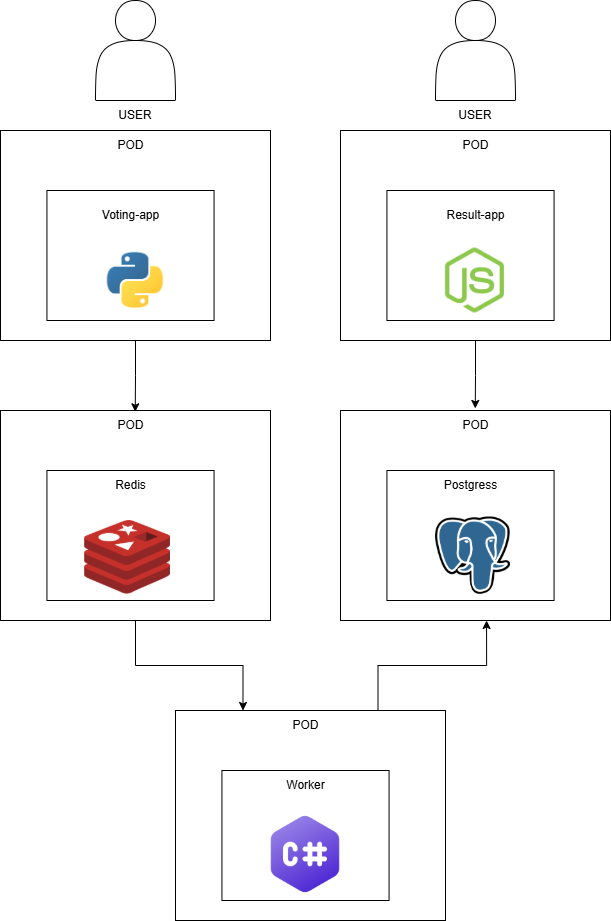

# Voting App - Forked Version

This project is a customized fork of the [Docker Voting App](https://github.com/dockersamples/example-voting-app), with enhancements for GitHub Actions CI/CD and Kubernetes deployments.



## 🗂 Folder Structure

| Folder/File         | Description                                                                 |
|---------------------|-----------------------------------------------------------------------------|
| `.github/workflows` | Contains GitHub Actions workflows for CI/CD pipeline.                      |
| `healthchecks`      | Microservice that checks the health of other components.                   |
| `k8s-specifications`| Kubernetes deployment YAMLs for all services.                              |
| `result`            | Service to display results from the Redis queue.                           |
| `vote`              | Frontend service where users cast their votes.                             |
| `worker`            | Backend worker service that transfers data from Redis to PostgreSQL.       |
| `Program.png`       | (Optional visual representation of your app/program - not shown here)      |

---

## ⚙️ GitHub Actions CI/CD Workflow

Located in `.github/workflows`, the pipeline runs **on every push** and does the following:

1. **Builds Docker images** for each microservice (`vote`, `result`, `worker`, etc.).
2. **Pushes** the images to GitHub Container Registry (`ghcr.io`).
3. Deployment is **manual** via `kubectl apply` from the `/k8s-specifications` folder.


## 🔐 Code Secret for kubectl Access to GitHub Container Registry
Before deploying, create a secret so Kubernetes can pull private images:

```bash
kubectl create secret docker-registry ghcr-secret \
  --docker-server=https://ghcr.io \
  --docker-username=InternshipPOC \
  --docker-password=<your_token> \
  --docker-email=<your_email>
```